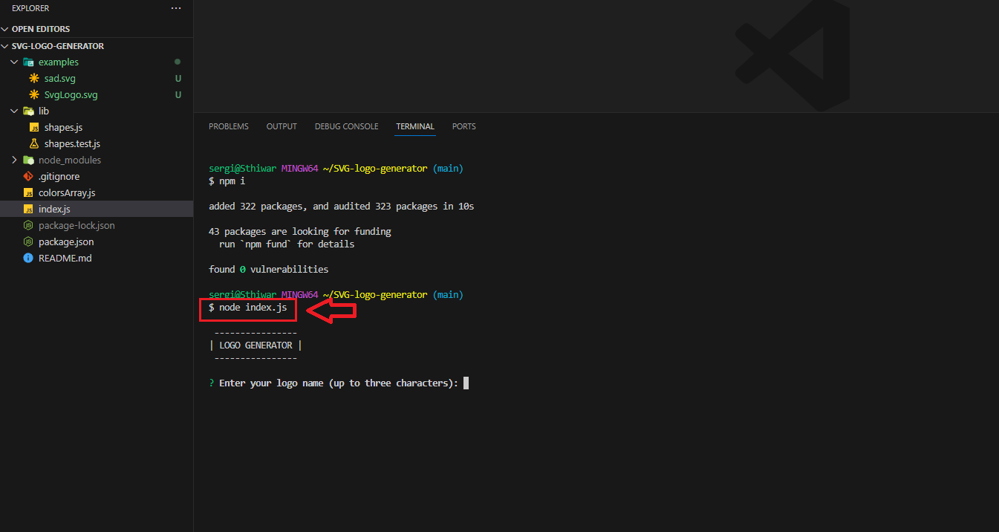

# SVG Logo Generator

## Description  :bookmark_tabs:
One of the main reasons why I wanted to create a logo generator was to provide a quick and simple tool for creating customizable logos through the command line. As a developer, the need for a lightweight utility to create basic logos with different shapes and text colors became apparent. Navigating through the challenges posed by object-oriented programming (OOP) was indeed a rigorous task, given its complexity. However, through persistent and extended study sessions, I managed to grasp the essential concepts, enabling me to comprehend the dificulty required to successfully complete the project. The Logo Generator addresses the challenge of creating logos on the fly by allowing users to input their desired logo name, text color, and shape; it is a simple and unique way to get a logo really fast. I did learn a lot throughout this project such as working with file system operations in Node.js, handling user input validation, and dynamically generating SVG content further deepened the understanding of JavaScript and its ecosystem.

## Installation :computer:

You are able to check this app by two ways:

 1. If you want to check a video of the functionality of the app, you can go to this URL: 
 2. If you want to try it yourself, you have to have "Node.js" installed in your computer, then you have to clone my repository and run it locally.

## Usage :bar_chart:

If you want to try the app yourself make sure you have "Node.js" in your computer, if you don't you can go to your browser and look it up and install it. After that, you have to clone the files into your computer. Then you have to open it in your code editor of preference (e.g. VSCode). Then in the terminal you have to run:
    
    npm i

 
 
 ---
After that run the next line:

    node index.js

 
 ---
After running the last code, you will have some questions and as soon as you are done answering them you will have a logo.svg created in the examples folder. You can open it (e.g. Google Chrome) and use it in your projects. Enjoy it!

 
 ---
# Examples:

 ---

 ---

 ---

## Credits :email:

List of all the links that made me succeed this project:
- https://stackoverflow.com/questions/54321161/how-to-write-a-file-to-specific-directory-in-nodejs
- https://developer.mozilla.org/en-US/docs/Web/JavaScript/Reference/Global_Objects/String/toUpperCase
- https://stackoverflow.com/questions/8027423/how-to-check-if-a-string-is-a-valid-hex-color-representation
- https://stackoverflow.com/questions/38296667/getting-unexpected-token-export 
- https://github.com/nestjs/nest/issues/680
- https://en.wikipedia.org/wiki/List_of_colors:_A%E2%80%93F
- https://javascript.plainenglish.io/how-to-inquirer-js-c10a4e05ef1f
- https://www.npmjs.com/package/@inquirer/prompts
- https://nodejs.org/en/learn/manipulating-files/working-with-folders-in-nodejs
- https://stackoverflow.com/questions/13542667/create-directory-when-writing-to-file-in-node-js
- https://developer.mozilla.org/en-US/docs/Web/SVG/Element/g
- https://www.digitalocean.com/community/tutorials/nodejs-how-to-use__dirname
- https://stackoverflow.com/questions/28725955/how-do-i-test-a-single-file-using-jest

## License :memo:
---
---
MIT License

Copyright (c) 2023 Sergio S. Ardila-Alvarado

Permission is hereby granted, free of charge, to any person obtaining a copy
of this software and associated documentation files (the "Software"), to deal
in the Software without restriction, including without limitation the rights
to use, copy, modify, merge, publish, distribute, sublicense, and/or sell
copies of the Software, and to permit persons to whom the Software is
furnished to do so, subject to the following conditions:

The above copyright notice and this permission notice shall be included in all
copies or substantial portions of the Software.

THE SOFTWARE IS PROVIDED "AS IS", WITHOUT WARRANTY OF ANY KIND, EXPRESS OR
IMPLIED, INCLUDING BUT NOT LIMITED TO THE WARRANTIES OF MERCHANTABILITY,
FITNESS FOR A PARTICULAR PURPOSE AND NONINFRINGEMENT. IN NO EVENT SHALL THE
AUTHORS OR COPYRIGHT HOLDERS BE LIABLE FOR ANY CLAIM, DAMAGES OR OTHER
LIABILITY, WHETHER IN AN ACTION OF CONTRACT, TORT OR OTHERWISE, ARISING FROM,
OUT OF OR IN CONNECTION WITH THE SOFTWARE OR THE USE OR OTHER DEALINGS IN THE
SOFTWARE.

---
---
